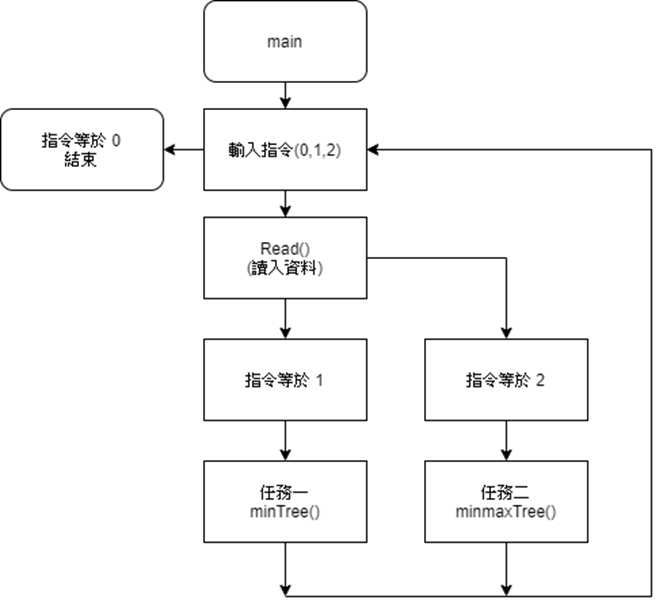
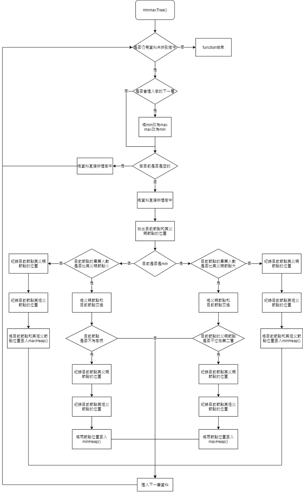
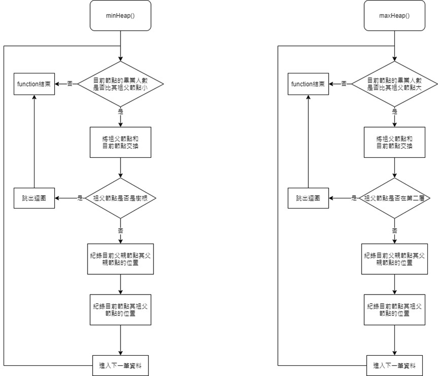

簡介
任務一:
在讀檔後將資料存入aList中，進入minTree()，先將aList中的第一項存入min的vector中，接著存入下一項，然後與存入資料的parent ((i-1)/2)做比較，如果存入的資料比較小，則和parent做交換，並繼續與原來parent的更上一層比較，直到不需要交換為止，然後重複加入下一項資料，再將排序完的min印出root、bottom、leftmost。

任務二:
再讀檔後，進入minmaxTree()，先在迴圈中宣告一個boolean minn，用來判斷現在是要用大於還是小於做比較，再將第一項存入minmax中，再和parent比較，如果需要就交換，然後和新增的資料所在位置的上上一項比較，並進行任務一的動作，重複對上上一項做比較和交換，直到不需要交換為止，接著新增下一筆資料，結束後再印出minmax的root、bottom、leftmost。

流程圖
Main

任務一

任務二

影片講解: https://youtu.be/AelSmQocR4k
