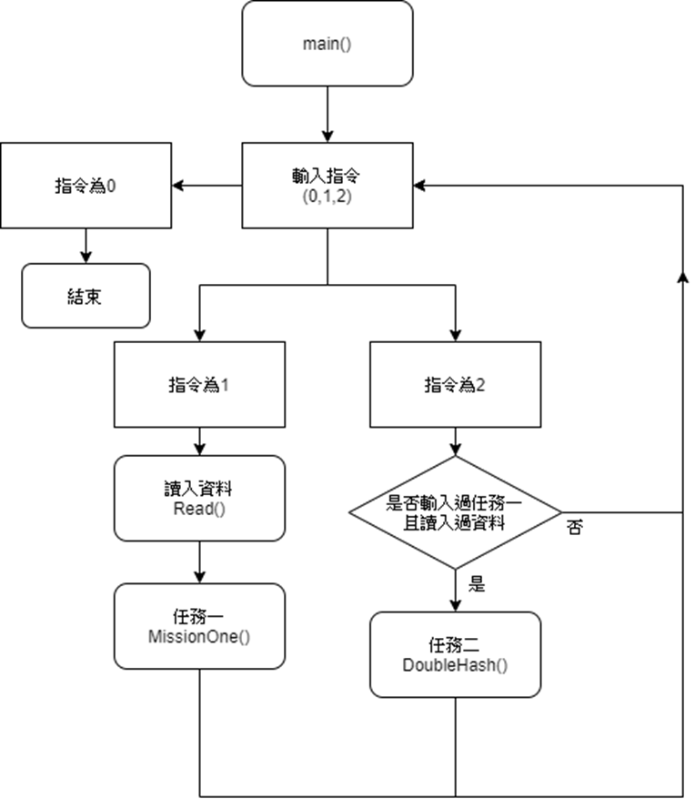
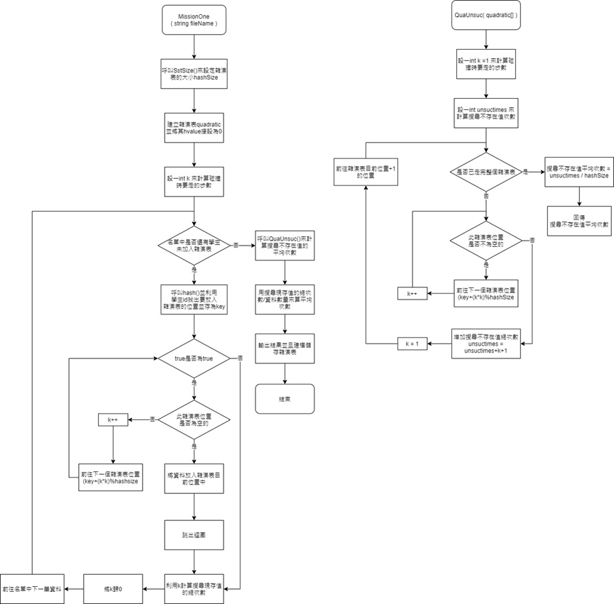
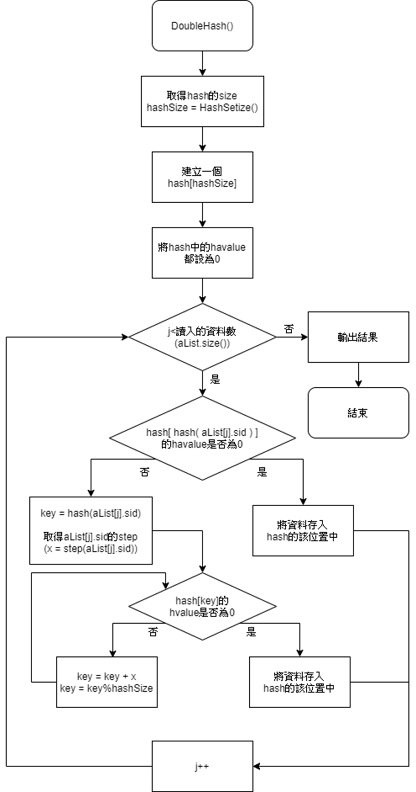
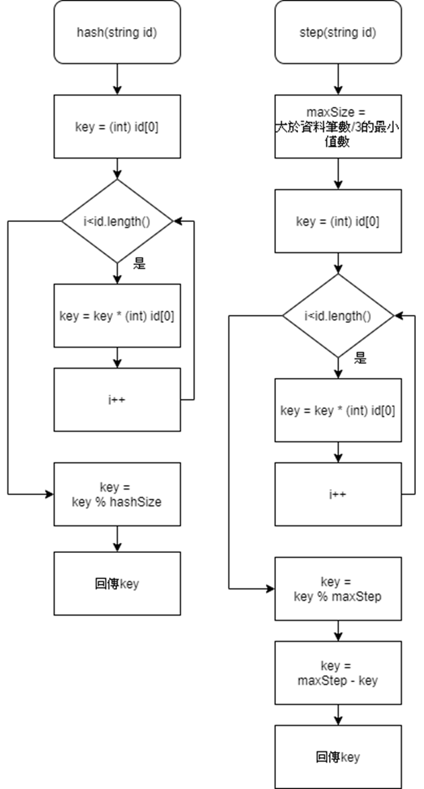

簡介
任務一:
先計算讀入的資料所需要的雜湊表大小，再建立一個雜湊表，一筆一筆加入雜湊表中，每當加入一筆新資料，先計算它的學號的雜湊值，確認與雜湊值對應的位置中是否為空的，如果是空的就加進去，如果不是，就計算它的step，(step為(1、2、3…)的平方，每用一次step就加一)，下一步為現在位置加step，直到找到空的位置，就將資料放進去，再加入下一筆新的資料，所有資料都加入後就輸出要求的結果。

任務二:
先計算讀入的資料所需要的雜湊表大小，再建立一個雜湊表，一筆一筆加入雜湊表中，每當加入一筆新資料，先計算它的學號的雜湊值，確認與雜湊值對應的位置中是否為空的，如果是空的就加進去，如果不是，就計算它的step，(step為最高步階-((所有學號的ASCII碼相乘)%最高步階))，下一步為現在位置加step，直到找到空的位置，就將資料放進去，再加入下一筆新的資料，所有資料都加入後就輸出要求的結果。

流程圖:
Main:

任務一: 

任務二:
 
Hash 和任務二的step:
 

影片講解: https://youtu.be/JKV4EmLyDtE
