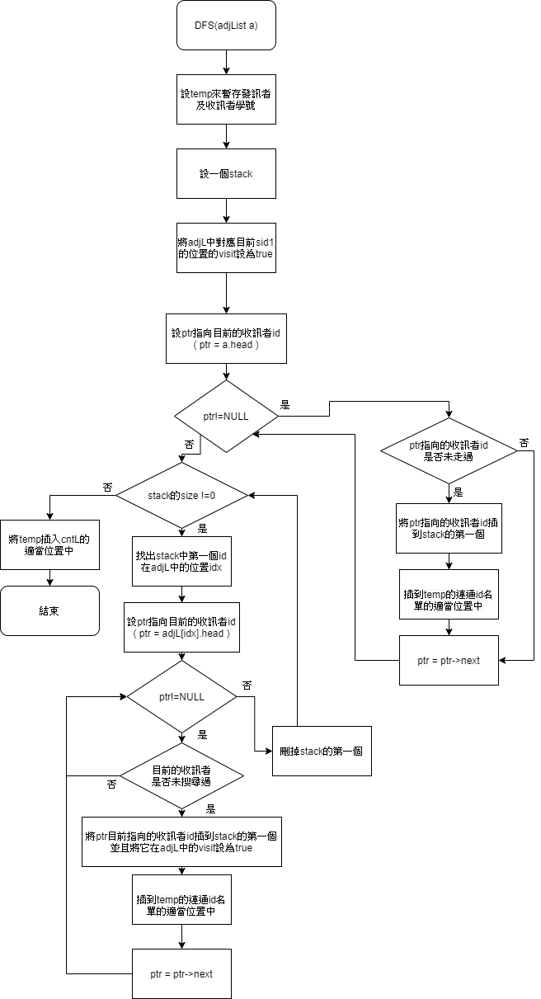
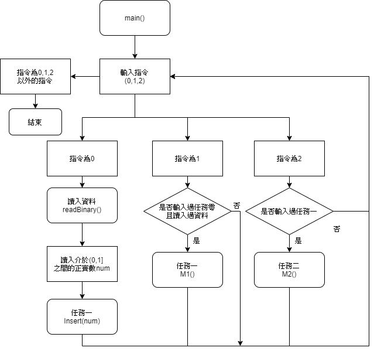

簡介 :

任務一 :

用任務零建立好的相鄰串列進行深度優先走訪，先判斷是否已走過，若未走過則用DFS找出其相連學號，與BFS類似，不過是將未走訪的學號存入堆疊中，然後走訪堆疊中的第一個學號，並將其所連通且未走過的學號存入堆疊及連通名單中，然後把堆疊的第一個刪掉，重複執行直到堆疊中沒有學號，然後將獲得的結果放入任務一的主陣列中，再做下一個未走訪過的學號，直到所有學號都走過。

任務二 :

在讀入學號後，建立一個與任務零建立的相鄰串列相同大小的float陣列，用來儲存最短路徑，將陣列中除了與讀入的學號對應的位置設為0之外，其他都設為99，然後尋找與目前學號相連的學號中路徑最短且未走過的學號，將它設為目前的學號，更新它所有相連且未走訪過的學號在float陣列中對應的值(若目前學號的路徑和相連學號的路徑相加小於該相連學號在float陣列中的值)，再重複尋找下一個未走過的最短路徑，直到所有學號都走過，即為獲得最短路徑長。

DFS:

Dijkstra:
.jpg)
Mission 1:

Mission 2:
.jpg)
main():

